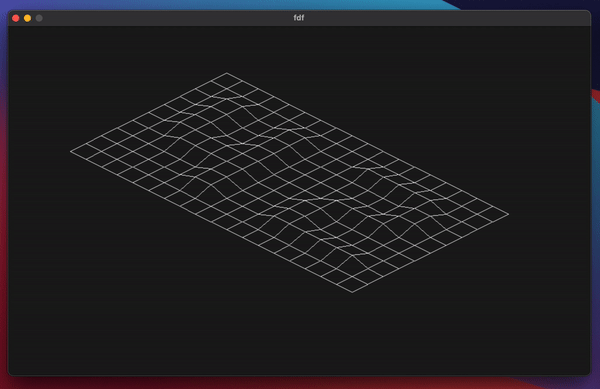

# FdF
school 42 project // this project is about creating a simple wireframe model of a landscape.

---

move: WASD  

zoom: -+

change z-value: QE

1 - for true isometric projection

2 - for 2:1 isometric projection
